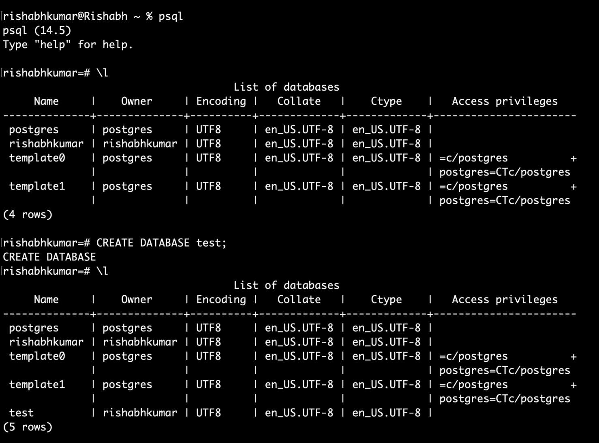
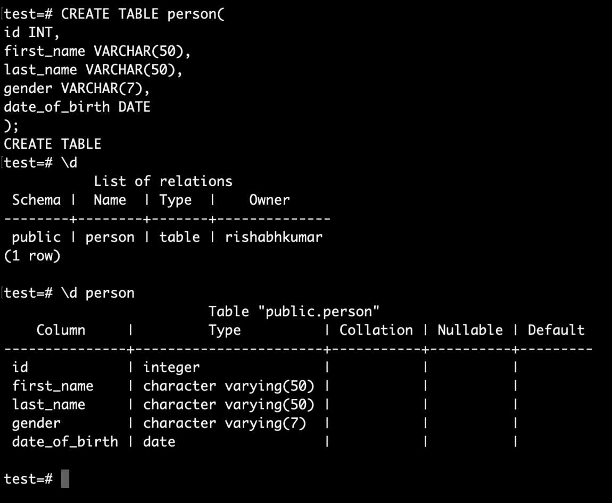

# Types of Databases
- Hierarchical databases
- Network databases
- Object-oriented databases
- Relational databases
- NoSQL databases

# SQL
SQL is a programming language

• Manage data held in a relational database
• Easy to learn
• Very powerful
• 1974
• Used all over the internet
# How data is stored
### Stores data in tables
- Columns
- Rows

# TABLE

# Relational database


# sql language types
- TCL (Transaction Control Language)
- DML (Data Manipulation Language)
- DCL (Data Control Language)
- DDL (Data Definition Language)

# SQL COMMAND 

### LIST OF ALL DATA BASE 
- `\l`

### CREATE DATA BASE
````
    CREATE DATABASE database_name;
````


## Change Data base 
````
    \c database_name
````


# How to create table with Postgres 

### CREATE TABLE WITHOUT CONSTRAINTS
````
CREATE TABLE table name (
Column name + data type + constraints if any
)

CREATE TABLE person (
id int, 
first_name VARCHAR (50), 
last name VARCHAR (50), 
gender VARCHAR (6),
date of birth TIMESTAMP,
)
````
## show all table in database 
````
\d 
````
## show perticular table 
````
\d table_name   // it show all info about table
````



